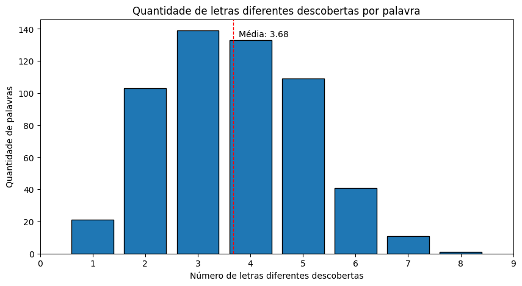

# Álgebra Linear - APS 7 - 2024.1 [Insper](https://www.insper.edu.br/pt/home)

## Autores do Projeto
- [Ian Cordibello Desponds](https://github.com/iancdesponds)
- [Luigi Orlandi Quinze](https://github.com/guizin-15)

# [Projeto - Jogo de Forca](https://github.com/iancdesponds/algebra-linear-jogo-da-forca)

## Descrição do Projeto

Neste projeto, desenvolvemos um algoritmo capaz de jogar o jogo da forca de forma automatizada. O algoritmo utiliza uma lista de palavras disponíveis para selecionar aleatoriamente uma palavra para o jogo. Ele também conta com uma estratégia inteligente para tentar adivinhar as letras que mais frequentemente aparecem nas palavras possíveis restantes, visando maximizar as chances de sucesso.

## Criação do algoritmo
O coração do nosso algoritmo é a função jogador_forca(), responsável por simular a interação de um jogador humano com o jogo da forca. Vamos explicar passo a passo como ela foi desenvolvida:

1. Inicialização do Jogo: Primeiramente, chamamos o método novo_jogo() da classe JogoDeForca para iniciar um novo jogo. Isso seleciona aleatoriamente uma palavra da lista de palavras disponíveis.
```python
jogo.novo_jogo()
```
2. Inicialização da Palavra Descoberta: Criamos uma lista chamada descoberta com o mesmo tamanho da palavra escolhida, preenchida com underscores (_). Essa lista representa as letras que o jogador já descobriu e as que ainda estão ocultas na palavra.
```python
descoberta = ['_']*len(jogo.palavra)
```
3. Seleção de Palavras Com Mesmo Tamanho: Criamos uma lista chamada palavras_com_mesmo_tamanho, contendo todas as palavras da lista de palavras disponíveis que têm o mesmo tamanho da palavra escolhida. Isso é útil para restringir as possibilidades durante o jogo.
```python
palavras_com_mesmo_tamanho = [palavra for palavra in jogo.content if len(palavra)==len(jogo.palavra)]
```
4. Loop Principal do Jogo: Enquanto o jogador ainda tiver vidas (jogo.vidas > 0), continuamos o jogo.
```python
while jogo.vidas > 0:
```
5. Atualização da Frequência de Letras: Calculamos a frequência de cada letra nas palavras que têm o mesmo tamanho da palavra escolhida. Isso nos ajuda a escolher letras que são mais prováveis de aparecer na palavra oculta.
```python
frequencia_letras = {}
for palavra in palavras_com_mesmo_tamanho:
    for letra in palavra:
        if letra in frequencia_letras:
            frequencia_letras[letra] += 1
        else:
            frequencia_letras[letra] = 1
```
6. Verificação de Condições de Vitória: Se não tem mais underscores (_) na lista descoberta, o jogador chuta a palavra correta e ganha o jogo.
```python
if '_' not in descoberta:
    palavra = ''.join(descoberta)
    jogo.tentar_palavra(palavra)
    break
```
7. Escolha da Próxima Letra: Escolhemos a próxima letra a ser tentada, dando preferência à letra com a maior frequência nas palavras restantes, que ainda não foi tentada.</br>
Ao fazer isso, temos mais chances de acertar a palavra oculta, pois estamos escolhendo a letra que é mais comum nas palavras possíveis restantes. Se a letra não estiver na palavra, eliminamos uma boa quantidade de palavras possíveis, o que facilita a adivinhação da palavra. (Entropia?)
```python
while True:
    print(frequencia_letras)
    letra = max(frequencia_letras, key=frequencia_letras.get)
    if letra in letras_passadas:
        del frequencia_letras[letra]
    else:
        break
```
8. Tentativa da Letra: Utilizamos o método tentar_letra(letra) da classe JogoDeForca para tentar adivinhar a letra escolhida. 
```python
letras_passadas.append(letra)
indices_letra = jogo.tentar_letra(letra)

```
9. Atualização da Lista de Palavras Restantes: Com base no resultado da tentativa da letra, atualizamos a lista palavras_com_mesmo_tamanho, removendo as palavras que não correspondem à letra tentada.
```python
if indices_letra == False:
    print("Perdeu! A palavra era: ", jogo.palavra)
    break
elif indices_letra == []:
    palavras_com_mesmo_tamanho = [palavra for palavra in palavras_com_mesmo_tamanho if all([palavra[idx]!=letra for idx in range(len(palavra))])]
else:
    palavras_com_mesmo_tamanho = [palavra for palavra in palavras_com_mesmo_tamanho if all([palavra[idx]==letra for idx in indices_letra])]
```
10. Atualização da Palavra Descoberta: Se a letra estiver correta, atualizamos a lista descoberta com as novas letras descobertas. Se estiver incorreta, reduzimos o número de vidas do jogador.
```python
for idx in indices_letra:
    descoberta[idx] = letra
```
11. Verificação de Condições de Fim de Jogo: Verificamos novamente se o jogador já descobriu a palavra completa ou se ele já perdeu todas as vidas. Se alguma das condições for verdadeira, encerramos o loop principal do jogo.
```python
if '_' not in descoberta and jogo.vidas > 0:
    palavra = ''.join(descoberta)
    jogo.tentar_palavra(palavra)
    break

if jogo.vidas == 0:
    print("Perdeu! A palavra era: ", jogo.palavra)
    break
```
12. Finalização do Jogo: Se o jogador ganhar o jogo, exibimos uma mensagem de vitória. Se ele perder o jogo, exibimos uma mensagem de derrota, juntamente com a palavra oculta.
```python
if jogo.vidas > 0:
    return True
```
13. Retorno do Resultado: Por fim, retornamos True se o jogador ganhou o jogo ou uma lista contendo a palavra oculta, a lista de letras descobertas e as letras que foram tentadas, caso o jogador tenha perdido o jogo.
Essa função encapsula toda a lógica do jogo da forca, tornando o algoritmo capaz de jogar de forma autônoma e analisar o desempenho em uma grande quantidade de jogos simulados.
```python
else:
    return [jogo.palavra, descoberta, letras_passadas]
```

## Testando o algoritmo

Para testar o algoritmo e analisar os casos de erro, executamos o algoritmo em 10.000 jogos simulados.<br/>
Registramos as palavras escolhidas, a evolução do jogo, as letras tentadas e os resultados finais.<br/>
Em seguida, analisamos os casos de erro para identificar padrões e possíveis melhorias no algoritmo.

### Analisando casos de Erro

Durante a análise dos casos de erro, identificamos algumas situações em que o algoritmo falhou em adivinhar a palavra correta.
<div align="center">
<br/>
<br/>
<br/>
<br/>
<br/>
</div>

## Como executar o código

Certifique-se de ter o `Python` instalado em seu sistema.

Baixe o código fonte no seu computador.

Abra um terminal na pasta onde o código está localizado.

Execute o seguinte comando para instalar as bibliotecas necessárias:
```bash
pip install -r requirements.txt
```

Em seguida, execute o seguinte comando para realizar as simulações do jogo da forca:
```bash
python main.py
```

Ou utilize o arquivo `main.ipynb` para rodar o código no Jupyter Notebook e ter uma visualização mais interativa.

## Linguagens e bibliotecas utilizadas

O algoritmo foi desenvolvido em `Python`, aproveitando as funcionalidades das bibliotecas `requests`, `random`, `pandas` e `matplotlib` para facilitar o desenvolvimento, realizar requisições web, análise de dados e visualização gráfica.